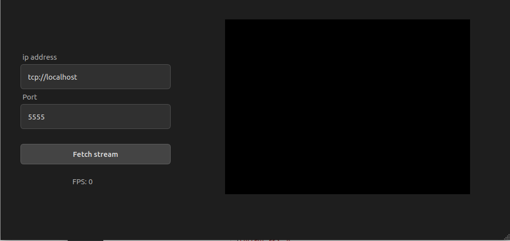

<<<<<<< HEAD
# ZMQ Remote Viewer

A Qt-based application for viewing video streams over ZeroMQ.

 *(optional)*

## Features
- Connects to ZMQ video streams
- Displays live video with FPS counter
- Adjustable connection settings

## Requirements
- Qt 5/6
- OpenCV
- ZeroMQ/cppzmq

## Build Instructions
```bash
mkdir build && cd build
cmake ..
make
```

## Usage
1. Run the Python publisher:
```bash
python publisher.py
```
2. Launch this application
3. Connect to `tcp://localhost:5555`

## License
MIT
=======
# ZMQ Remote Viewer

A Qt-based application for viewing video streams over ZeroMQ.

 *(optional)*

## Features
- Connects to ZMQ video streams
- Displays live video with FPS counter
- Adjustable connection settings

## Requirements
- Qt 5/6
- OpenCV
- ZeroMQ/cppzmq

## Build Instructions
```bash
mkdir build && cd build
cmake ..
make
```

## Usage
1. Run the Python publisher:
```bash
python publisher.py
```
2. Launch this application
3. Connect to `tcp://localhost:5555`

## License
MIT
>>>>>>> 18c7b8e (Merge remote changes)
